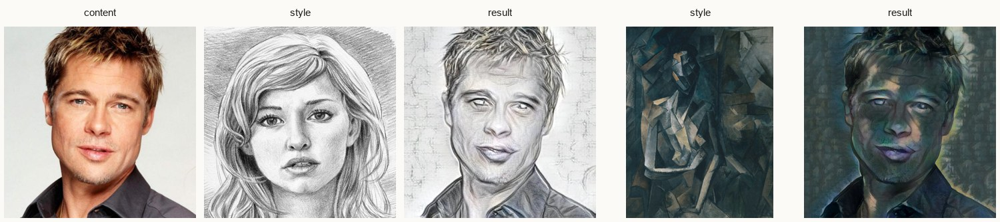
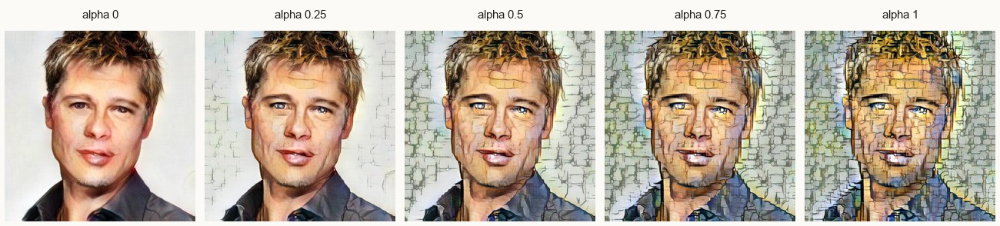
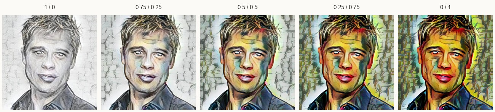
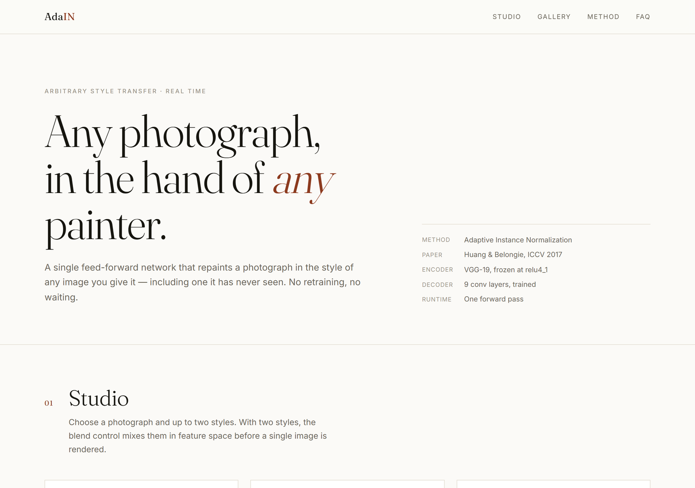
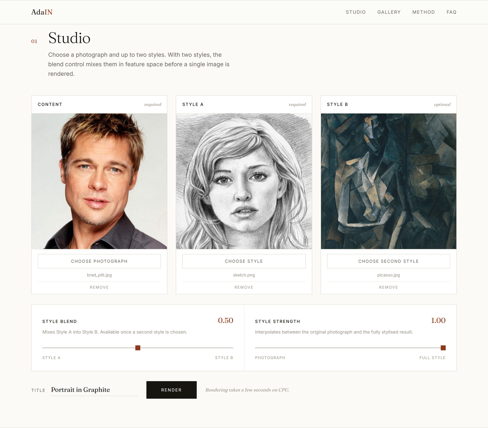
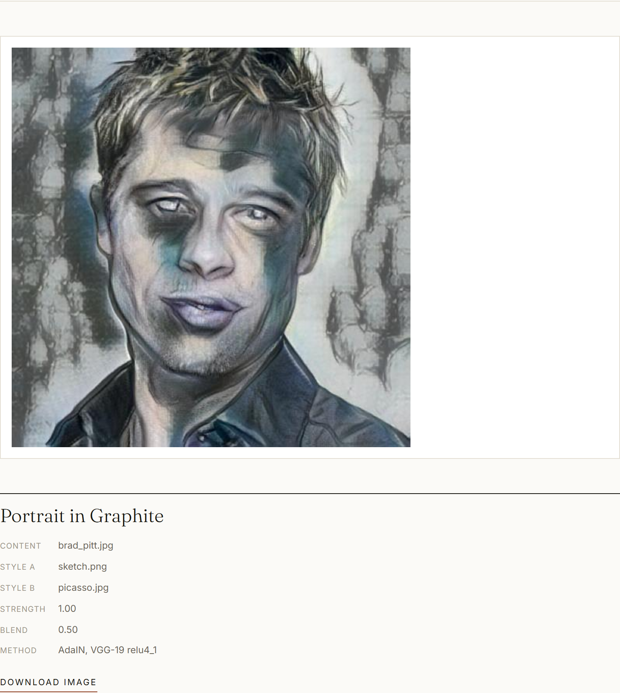

# Neural Style Transfer with Adaptive Instance Normalization

A PyTorch implementation of arbitrary neural style transfer, served through a Flask web
application — any photograph rendered in the style of any image, in a single forward pass,
with no per-style retraining.



---

## Overview

Classical neural style transfer either optimises each output image for minutes (Gatys et al.,
2015) or trains a separate network for every style (Johnson et al., 2016). This project
implements the method from **Huang & Belongie, *Arbitrary Style Transfer in Real-time with
Adaptive Instance Normalization*, ICCV 2017**, which resolves that trade-off: one trained
decoder handles unlimited styles because the styling operation itself has no learned parameters.

The repository contains the full pipeline — model definitions, the training script, a
command-line interface, a Flask web application, a test suite, and an analysis notebook that
empirically verifies the assumption the method rests on.

## Problem statement

Style transfer methods before AdaIN forced a choice between flexibility and speed:

| Approach | Arbitrary styles | Speed |
| --- | --- | --- |
| Gatys et al. (2015) — per-image optimisation | Yes | Minutes per image |
| Johnson et al. (2016) — feed-forward, per style | No, one network per style | Milliseconds |
| **AdaIN (this project)** | **Yes** | **One forward pass** |

The underlying problem is separating *content* from *style* so one can be swapped without
retraining. AdaIN's answer: a CNN feature map's **spatial arrangement** encodes content, while
its **per-channel mean and standard deviation** encode style. Replace the statistics, keep the
arrangement.

## Key features

- **Arbitrary style transfer** — any style image works on the first attempt, including images
  never seen during training
- **Style strength control (α)** — runtime interpolation between the original photograph and
  the fully stylised result
- **Two-style blending** — interpolates between two styles in feature space (paper Eq. 15)
- **Web interface** — upload, preview, adjust, render, download; server-rendered, no build step
- **Command-line interface** — batch rendering, α sweeps and multi-style blends
- **Training script** — full training loop implementing the paper's content and style losses
- **Test suite** — 33 tests covering model invariants, the AdaIN mathematics, and the web layer
- **Analysis notebook** — measures the content/style separation the method depends on

### Style strength



### Two-style blending



## Tech stack

| Layer | Technology |
| --- | --- |
| Deep learning | PyTorch 2.2.2, torchvision 0.17.2 |
| Model | VGG-19 encoder (frozen) + custom convolutional decoder |
| Web framework | Flask 3.1.2, Jinja2, Flask-WTF / WTForms |
| Image processing | Pillow |
| Frontend | Hand-written HTML/CSS/JavaScript (no framework, no build step) |
| Testing | pytest |
| Analysis | Jupyter, matplotlib |
| Deployment | Gunicorn (`Procfile` included) |

## System architecture

```
                    ┌─────────────────────┐
  content image ───►│  VGG-19 encoder     │──┐
                    │  (frozen, relu4_1)  │  │
                    └─────────────────────┘  │
                                             ▼
                                        ┌─────────┐      ┌──────────────┐
                                        │  AdaIN  │─────►│  α blending  │
                                        └─────────┘      └──────┬───────┘
                    ┌─────────────────────┐  ▲                  │
  style image(s) ──►│  VGG-19 encoder     │──┘                  ▼
                    │  (shared weights)   │            ┌──────────────────┐
                    └─────────────────────┘            │  Decoder         │
                                                       │  (trained)       │
                                                       └────────┬─────────┘
                                                                ▼
                                                          output image
```

The application is a **stateless single-process Flask server**. Both models are loaded once at
startup and reused across requests. There is no database and no background job queue — each
request is handled synchronously in one forward pass.

## Workflow

1. **Upload** — the client posts a content image and one or two style images
2. **Validate** — the extension is checked against an allow-list, then the file is opened with
   Pillow to confirm it is genuinely decodable
3. **Preprocess** — each image is resized so its shorter side is 512 px, aspect ratio
   preserved, and converted to a `[0,1]` tensor
4. **Encode** — both images pass through the frozen VGG-19 truncated at `relu4_1`; a 512 × 512
   input becomes a `512 × 64 × 64` feature map
5. **Adapt** — AdaIN aligns the content features' per-channel statistics to the style's; with
   two styles, the per-style AdaIN outputs are averaged using the blend weights
6. **Blend** — `α · adain + (1 − α) · content_features` applies the style-strength control
7. **Decode** — the trained decoder upsamples ×8 back to image resolution
8. **Postprocess** — clamped to `[0,1]`, saved as JPEG under a collision-proof filename, and
   returned to the page with a download link

## Technical implementation details

### Adaptive Instance Normalization

```python
def adaptive_instance_normalization(content_feat, style_feat):
    size = content_feat.size()
    style_mean, style_std = calc_mean_std(style_feat)
    content_mean, content_std = calc_mean_std(content_feat)
    normalized = (content_feat - content_mean.expand(size)) / content_std.expand(size)
    return normalized * style_std.expand(size) + style_mean.expand(size)
```

$$\mathrm{AdaIN}(x, y) = \sigma(y)\left(\frac{x - \mu(x)}{\sigma(x)}\right) + \mu(y)$$

Statistics are computed per sample and per channel across spatial dimensions only. **The layer
has no learnable parameters**, which is precisely why an unseen style requires no retraining.

### Encoder

VGG-19 rebuilt as a flat `nn.Sequential` so layer indices match the pretrained checkpoint, then
truncated to the first 31 layers (up to `relu4_1`). All parameters have `requires_grad = False`.
Reflection padding is used throughout to avoid border artifacts. The network is split into four
blocks so intermediate activations (`relu1_1`, `relu2_1`, `relu3_1`, `relu4_1`) can be tapped
for the style loss during training.

### Decoder

Mirrors the encoder: 9 convolutional layers, 3 nearest-neighbour upsampling stages, reflection
padding. Two deliberate choices carried over from the paper:

- **Nearest-neighbour upsampling** rather than transposed convolution, which avoids
  checkerboard artifacts
- **No normalisation layers.** BatchNorm would pull every output toward one shared style and
  InstanceNorm toward a single style per sample — both destroy the arbitrary-style property.
  The test suite asserts their absence.

### Style interpolation (paper Eq. 15)

```python
def style_interpolation(content_feat, style_feats, weights):
    interpolated_feat = torch.zeros_like(content_feat)
    for style_feat, weight in zip(style_feats, weights):
        interpolated_feat += weight * adaptive_instance_normalization(content_feat, style_feat)
    return interpolated_feat
```

Because every AdaIN output shares the same normalised content tensor, averaging the outputs is
mathematically equivalent to averaging the styles' affine parameters — the content structure
factors out and is never disturbed.

### Training objective

`L = L_content + λ · L_style`

- **Content loss** — MSE between the encoder's `relu4_1` response to the generated image and
  the AdaIN output `t`. The target is `t`, not the content image: the decoder is trained
  specifically to *invert AdaIN*.
- **Style loss** — MSE between per-channel means and standard deviations of the generated and
  style images at `relu1_1`, `relu2_1`, `relu3_1` and `relu4_1`. No Gram matrices — since AdaIN
  transfers only means and variances, the loss measures only those.

### Input validation

Uploads are validated by **content, not filename**: the extension is checked against an
allow-list, then Pillow attempts to open the saved file. Files failing either check are rejected
with a specific message rather than silently discarded. Results are written as
`stylized_<uuid8>_<name>.jpg` so concurrent renders cannot overwrite one another.

## Database

**None.** The application is stateless. Uploads and results are written to disk under
`static/uploads/` and referenced by filename; nothing is persisted between sessions and no user
data is stored.

## AI/ML methodology

| Component | Detail |
| --- | --- |
| Encoder | VGG-19, pretrained, frozen, truncated at `relu4_1` |
| Feature space | 512 channels; 64 × 64 spatial grid for a 512 px input |
| Style representation | Per-channel mean and standard deviation (512 pairs) |
| Style transfer operation | AdaIN — parameter-free affine statistic transfer |
| Trained component | Decoder only (9 conv layers, 18 weight tensors) |
| Loss | Perceptual content loss + multi-layer statistic style loss |
| Optimiser | Adam, lr 1e-4 with inverse-time decay |
| Runtime controls | α interpolation (Eq. 14), multi-style interpolation (Eq. 15) |

A pretrained decoder checkpoint (`experiment/final_exp/decoder_final.pth`) is included so the
project runs immediately after cloning. The hyperparameters that produced it are recorded in
`experiment/final_exp/options.txt`, and `train.py` implements the same training procedure.

## Results

**Measured on this implementation** (CPU, 512 px images):

| Metric | Value |
| --- | --- |
| Inference time per image | ~3.2 s (CPU, after model load) |
| Model load time | ~5 s (one-off at startup) |
| Test suite | 33/33 passing, ~50 s |
| Encoder | 77 MB, frozen |
| Decoder | 13.4 MB, 18 weight tensors |

**Content/style separation** — measured in `code.ipynb` by comparing `relu4_1` feature
statistics between a content photograph, a style image, and the stylised result:

| Pair | Mean distance | Std distance |
| --- | ---: | ---: |
| result vs style | 4.77 | 3.36 |
| result vs content | 12.49 | 10.02 |
| content vs style | 13.42 | 10.29 |

The result's feature statistics sit far closer to the style image than to the photograph it was
generated from, while its activation maps remain structurally those of the photograph. This is
the empirical basis of the method, measured on this implementation rather than quoted.

For reference, the original paper reports 0.065 s at 512 px on a Pascal Titan X GPU.

## Screenshots

**Landing page** — method summary and model configuration



**Studio** — three upload slots with live previews, plus the style-blend and style-strength
controls. The blend control is enabled only once a second style is chosen.



**Result** — the rendered output, labelled with the inputs and parameters used to produce it



## Installation

Requires **Python 3.10**.

```bash
git clone https://github.com/gusaindisha2004/neural-style-transfer-adain.git
cd neural-style-transfer-adain
```

Create the virtual environment **outside** the project directory on Windows — PyTorch has
deeply nested paths that can exceed the 260-character path limit:

```bash
python -m venv C:\venvs\nst
C:\venvs\nst\Scripts\activate
pip install -r requirements.txt
```

On Linux or macOS:

```bash
python -m venv .venv && source .venv/bin/activate
pip install -r requirements.txt
```

Both model checkpoints are included in the repository — no additional downloads are required.

## Running the project

### Web application

```bash
cd NST_Code
python app.py
```

Open <http://localhost:5000>. Upload a photograph and one or two styles, adjust the sliders,
and press **Render**.

Set a real session key before deploying anywhere public:

```bash
export SECRET_KEY="your-random-secret"
```

On Windows, use `set SECRET_KEY=your-random-secret`.

### Command line

```bash
python stylize.py --content examples/brad_pitt.jpg --style style_data/mondrian.jpg
```

```bash
python stylize.py --content examples/brad_pitt.jpg --style style_data/sketch.png style_data/la_muse.jpg --style_weights 0.5 0.5
```

| Option | Default | Meaning |
| --- | --- | --- |
| `--content` | required | Content image path |
| `--style` | required | One or more style image paths |
| `--style_weights` | equal | Weight per style; normalised to sum to 1 |
| `--alpha` | `1.0` | Style strength; accepts several values for a sweep |
| `--size` | `512` | Shorter side is resized to this before encoding |
| `--output_dir` | `output/` | Where results are written |

### Tests

```bash
pip install -r requirements-dev.txt
cd NST_Code
pytest -v
```

### Training

```bash
python train.py --content_dir path/to/coco --style_dir path/to/paintings --batch_size 16 --epochs 200 --style_weight 10 --experiment my_run
```

Running `python train.py` with no arguments uses the small bundled sample folders — enough to
verify the pipeline executes, not to produce a usable model. Real training requires large
datasets (the paper uses MS-COCO and WikiArt, roughly 80,000 images each) and a GPU.

## Project structure

```
.
├── NST_Code/
│   ├── app.py                        Flask application and inference endpoint
│   ├── stylize.py                    command-line interface
│   ├── train.py                      decoder training script
│   ├── vgg_normalised.pth            pretrained VGG-19 weights (frozen encoder)
│   ├── utils/
│   │   ├── models.py                 VGGEncoder and Decoder definitions
│   │   └── utils.py                  AdaIN, style interpolation, dataset, transforms
│   ├── tests/
│   │   └── test_adain.py             33 tests
│   ├── templates/
│   │   └── index.html                web interface
│   ├── static/uploads/               runtime uploads and results (git-ignored)
│   ├── content_data/                 sample photographs
│   ├── style_data/                   sample style images
│   ├── examples/                     images used by the gallery section
│   └── experiment/final_exp/
│       ├── decoder_final.pth         trained decoder checkpoint
│       ├── options.txt               hyperparameters used to train it
│       └── sample_iter_*.jpg         training progress samples
├── docs/                             figures used in this README
├── Demo_IO_Images/                   reference inputs and outputs
├── code.ipynb                        feature-map analysis notebook
├── requirements.txt                  runtime dependencies
├── requirements-dev.txt              tests and notebook
├── LICENSE
└── Procfile
```

## Technical challenges and considerations

- **Validating uploads by content, not extension.** An extension allow-list alone silently
  discarded common formats such as `.webp` and `.jfif`, clearing the user's selection with no
  explanation. Validation now opens each file with Pillow and reports a specific reason on
  failure; both cases are covered by regression tests.
- **Cross-platform paths.** Model and dataset paths resolve relative to
  `Path(__file__).resolve().parent` so the application runs from any working directory, and
  checkpoints load with `map_location` so GPU-saved weights restore correctly on CPU.
- **Choosing what the decoder must not contain.** Adding BatchNorm or InstanceNorm to the
  decoder is an easy and silent mistake that degrades arbitrary-style capability. The test suite
  asserts their absence.
- **Loss scaling is not intuitive.** The style loss sums eight MSE terms (mean and std at four
  depths) against a single content term, so `style_weight` is not a direct "style matters N×
  more" ratio and is not portable between implementations.
- **Repository size.** The frozen VGG-19 encoder is 77 MB. It is committed so the project runs
  immediately after cloning; training progress images were re-encoded from PNG to JPEG,
  reducing the repository by roughly 50 MB.
- **Concurrent-render collisions.** Results were originally named after the content file and
  overwrote one another; filenames now include a UUID fragment.

## Future scope

- **Colour preservation** — apply style texture while retaining the content image's original
  colours (described in the paper, not yet implemented)
- **Spatial control** — apply different styles to different regions of the same image
- **Video style transfer** — the paper notes style statistics can be encoded once and reused
  across frames
- **GPU deployment** — the code is device-agnostic; a CUDA host would reduce inference from
  seconds to milliseconds
- **Asynchronous rendering** — a task queue would allow concurrent users without blocking
- **Training a decoder from scratch** on MS-COCO and WikiArt to reproduce the checkpoint

## References

1. Huang & Belongie — [Arbitrary Style Transfer in Real-time with Adaptive Instance Normalization](https://arxiv.org/abs/1703.06868) (ICCV 2017)
2. Gatys, Ecker & Bethge — [A Neural Algorithm of Artistic Style](https://arxiv.org/abs/1508.06576) (2015)
3. Johnson, Alahi & Fei-Fei — [Perceptual Losses for Real-Time Style Transfer and Super-Resolution](https://arxiv.org/abs/1603.08155) (ECCV 2016)
4. Simonyan & Zisserman — [Very Deep Convolutional Networks for Large-Scale Image Recognition](https://arxiv.org/abs/1409.1556) (2014)

## Licence

MIT — see [LICENSE](LICENSE). The pretrained VGG-19 weights are the "normalised" VGG
distributed with the original AdaIN implementation by Xun Huang and are used unmodified. Sample
content and style images are included for demonstration only and remain the property of their
respective owners.

## Author

**Disha Gusain**

- GitHub: [@gusaindisha2004](https://github.com/gusaindisha2004)

Built as an independent implementation study of the AdaIN method, working from the original
ICCV 2017 paper and a reference implementation.
